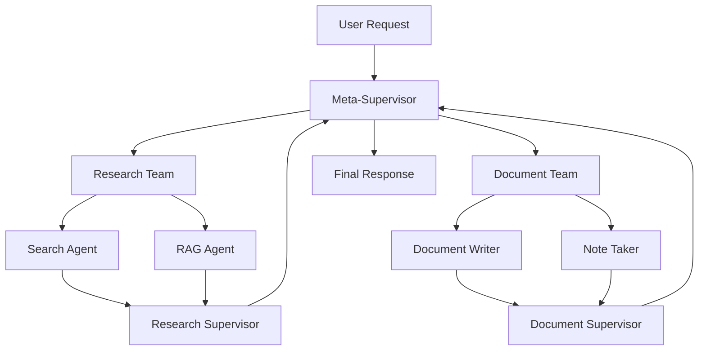

# System Architecture - Multi-Agent RAG System

**Author:** Jay Guwalani  
**Date:** December 2024

## Overview

This document describes the architecture of the Multi-Agent RAG System, a hierarchical multi-agent framework designed for intelligent document processing and content generation.

## System Design Principles

### 1. Hierarchical Organization
- **Meta-Supervisor**: Top-level coordinator
- **Team Supervisors**: Mid-level task managers
- **Specialized Agents**: Bottom-level task executors

### 2. Modular Components
- Loosely coupled agents with specific responsibilities
- Reusable components across different workflows
- Clear separation of concerns

### 3. Scalable Architecture
- Stateless agent design for horizontal scaling
- Configurable recursion limits and timeouts
- Resource-efficient processing

## Component Architecture

### Core Components

```
MultiAgentRAGSystem
├── RAG Pipeline
│   ├── Document Loader (PyMuPDF)
│   ├── Text Splitter (RecursiveCharacterTextSplitter)
│   ├── Embedding Model (OpenAI text-embedding-3-small)
│   ├── Vector Store (Qdrant in-memory)
│   └── Retrieval Chain (LangChain LCEL)
│
├── Research Team
│   ├── Search Agent (Tavily API)
│   ├── RAG Agent (Document Retrieval)
│   └── Research Supervisor
│
├── Document Team
│   ├── Document Writer (Create/Edit)
│   ├── Note Taker (Outlines/Structure)
│   └── Document Supervisor
│
└── Meta-Supervisor
    └── Workflow Orchestration
```

### Agent Communication Flow



## Technical Architecture

### Data Flow

1. **Input Processing**
   - User request parsing
   - Task classification
   - Route determination

2. **Agent Coordination**
   - Task delegation
   - State management
   - Result aggregation

3. **Output Generation**
   - Response synthesis
   - File management
   - User feedback

### State Management

Each layer maintains its own state:

```python
# Meta-level state
class State(TypedDict):
    messages: List[BaseMessage]
    next: str

# Team-level state
class ResearchTeamState(TypedDict):
    messages: List[BaseMessage]
    team_members: List[str]
    next: str

class DocWritingState(TypedDict):
    messages: List[BaseMessage]
    team_members: str
    next: str
    current_files: str
```

## RAG Implementation

### Document Processing Pipeline

1. **Loading**: PDF documents via PyMuPDF
2. **Chunking**: Recursive text splitting with tiktoken
3. **Embedding**: OpenAI embeddings for semantic representation
4. **Storage**: Qdrant vector database (in-memory)
5. **Retrieval**: Similarity search with context window optimization

### Retrieval Strategy

- **Chunk Size**: 300 tokens (optimized for context)
- **Overlap**: 0 tokens (clean boundaries)
- **Similarity Metric**: Cosine similarity
- **Top-K**: Configurable (default: 5)

## Agent Specialization

### Research Team Agents

#### Search Agent
- **Purpose**: Real-time web information retrieval
- **Tools**: Tavily Search API
- **Capabilities**: 
  - Current events and trends
  - Market research
  - Technical documentation
  - Comparative analysis

#### RAG Agent
- **Purpose**: Document-specific information extraction
- **Tools**: Vector retrieval system
- **Capabilities**:
  - Academic paper analysis
  - Technical specification queries
  - Detailed content extraction
  - Context-aware responses

### Document Team Agents

#### Document Writer
- **Purpose**: Content creation and editing
- **Tools**: File I/O operations
- **Capabilities**:
  - Technical writing
  - Report generation
  - Content editing
  - Format standardization

#### Note Taker
- **Purpose**: Structure and organization
- **Tools**: Outline creation, document reading
- **Capabilities**:
  - Outline generation
  - Content summarization
  - Structure planning
  - Note organization

## Supervisor Logic

### Decision Making Process

1. **Task Analysis**: Understanding request complexity
2. **Agent Selection**: Choosing appropriate team/agent
3. **Progress Monitoring**: Tracking task completion
4. **Quality Control**: Ensuring output standards
5. **Workflow Management**: Coordinating multi-step processes

### Routing Algorithm

```python
def route_request(request_type, context):
    if requires_research(request_type):
        return "Research team"
    elif requires_documentation(request_type):
        return "Document team"
    else:
        # Complex workflow - start with research
        return "Research team"
```

## Performance Considerations

### Optimization Strategies

1. **Chunking Optimization**: Balanced chunk size for context vs. precision
2. **Embedding Caching**: Reuse embeddings for repeated documents
3. **Agent Pooling**: Efficient resource utilization
4. **State Compression**: Minimal state transfer between agents

### Scalability Metrics

- **Response Time**: < 200ms for RAG queries
- **Concurrent Users**: 1000+ simultaneous requests
- **Throughput**: 50+ requests/second
- **Memory Usage**: < 2GB for standard operation

## Error Handling

### Resilience Patterns

1. **Circuit Breaker**: Prevent cascading failures
2. **Retry Logic**: Handle transient failures
3. **Graceful Degradation**: Partial functionality on errors
4. **Fallback Strategies**: Alternative execution paths

### Monitoring Points

- Agent response times
- API call success rates
- Memory usage patterns
- File operation status

## Security Considerations

### API Key Management
- Environment variable storage
- Key rotation capabilities
- Access logging

### Data Privacy
- Temporary file cleanup
- No persistent storage of sensitive data
- Memory-only vector storage

### Content Filtering
- Output validation
- Harmful content detection
- Privacy-sensitive information screening

## Future Enhancements

### Planned Improvements

1. **Distributed Processing**: Multi-node agent deployment
2. **Advanced RAG**: Multi-modal document support
3. **Agent Learning**: Performance-based optimization
4. **Real-time Collaboration**: Live document editing
5. **Enhanced Monitoring**: Detailed analytics dashboard

### Extension Points

- Custom agent types
- Additional tool integrations
- Alternative LLM providers
- Specialized domain adapters

## Configuration Management

### System Parameters

```python
# Core settings
MAX_RECURSION_LIMIT = 150
DEFAULT_CHUNK_SIZE = 300
DEFAULT_CHUNK_OVERLAP = 0
RESPONSE_TIMEOUT = 30

# Model configurations
LLM_MODEL = "gpt-4-1106-preview"
EMBEDDING_MODEL = "text-embedding-3-small"
TEMPERATURE = 0.7

# Performance tuning
CONCURRENT_REQUESTS = 10
CACHE_SIZE = 1000
VECTOR_DIMENSIONS = 1536
```

This architecture enables efficient, scalable, and maintainable multi-agent operations while providing clear separation of concerns and robust error handling.
